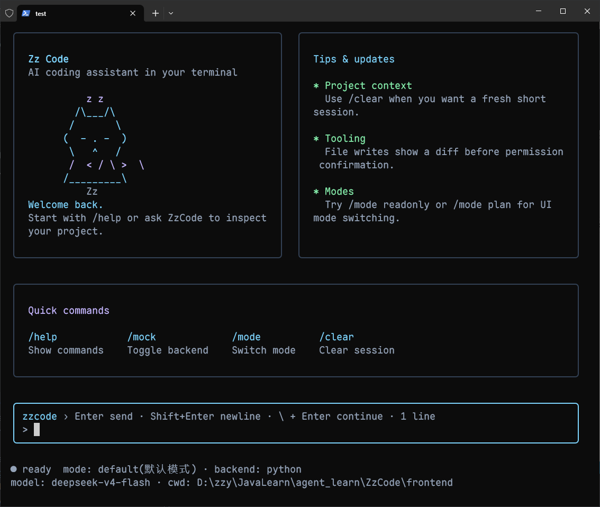

# ZzCode

ZzCode 是一个用于学习现代 Code Agent 工作机制的 Python + React Ink 终端编程助手。

它不是为了直接复刻完整的 Claude Code，而是从一个可运行、可调试、可逐步扩展的最小 Agent 开始，分阶段理解终端智能体中的 ReAct、工具调用、权限确认、上下文记忆、前后端协议和 TUI 交互。



## Overview

ZzCode 当前的核心形态是一个本地 Code Agent CLI：

```text
Terminal UI
  -> JSON Lines Protocol
  -> Python Agent Core
  -> LLM Provider
  -> Tool Registry
  -> Local Tool Execution
```

前端负责终端交互和消息展示，后端负责 Agent 主循环、模型调用、工具执行、上下文管理和子 Agent 调度。两侧通过事件协议通信，便于后续继续扩展 Plan Mode、MCP 和更完整的多 Agent 能力。

## Capabilities

- ReAct 风格 Agent 主循环
- OpenAI-compatible LLM 接入
- 本地文件和命令工具
- React + Ink 终端 UI
- JSON Lines 前后端通信
- 工具执行前权限确认
- 多行输入和历史输入
- Markdown 风格记忆文件
- 当前会话短期记忆
- Session notes 和基础 Compact 支持
- 用户可调用 Subagents
- 系统 Subagents，用于 session memory 更新和 auto memory 提取

## Architecture

```text
ZzCode/
├── frontend/          React + Ink terminal UI
├── src/zzcode/        Python Agent core
│   ├── agent/         ReAct loop
│   ├── llm/           model provider adapter
│   ├── memory/        markdown memory and context
│   ├── protocol/      JSON Lines backend
│   ├── subagents/     user and system subagents
│   └── tools/         local tool registry
├── docs/              phase notes and design records
└── tests/             focused behavior tests
```

## Learning Roadmap

ZzCode 按阶段推进，每个阶段都优先让核心机制清晰可见：

1. ReAct + Tool Call 最小闭环
2. React + Ink 终端 UI 和 JSON Lines 协议
3. 工具权限确认和文件变更预览
4. Claude Code 风格 Markdown Memory
5. Session notes 和基础 Compact
6. Claude Code 风格 Subagents
7. Plan Mode
8. MCP 接入

## Documentation

- [AGENTS.md](AGENTS.md)：项目协作规则、架构约定和注释规范
- [docs/phase-01-react-toolcall-demo.md](docs/phase-01-react-toolcall-demo.md)：第一阶段 ReAct + Tool Call 学习记录
- [docs/phase-02-memory-system.md](docs/phase-02-memory-system.md)：第二阶段 Memory System 学习记录
- [docs/phase-03-subagents.md](docs/phase-03-subagents.md)：第三阶段 Subagents 学习记录
- [docs/phase-03-claude-subagents-reference.md](docs/phase-03-claude-subagents-reference.md)：Claude Code 子 Agent 实现参考摘录

README 只保留项目展示和总体框架。具体设计取舍、实现步骤、验收记录和后续 TODO 放在 `docs/` 中维护。
